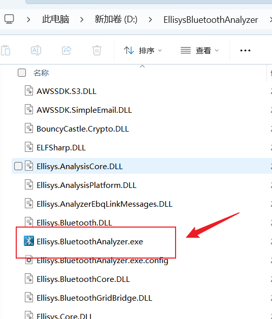
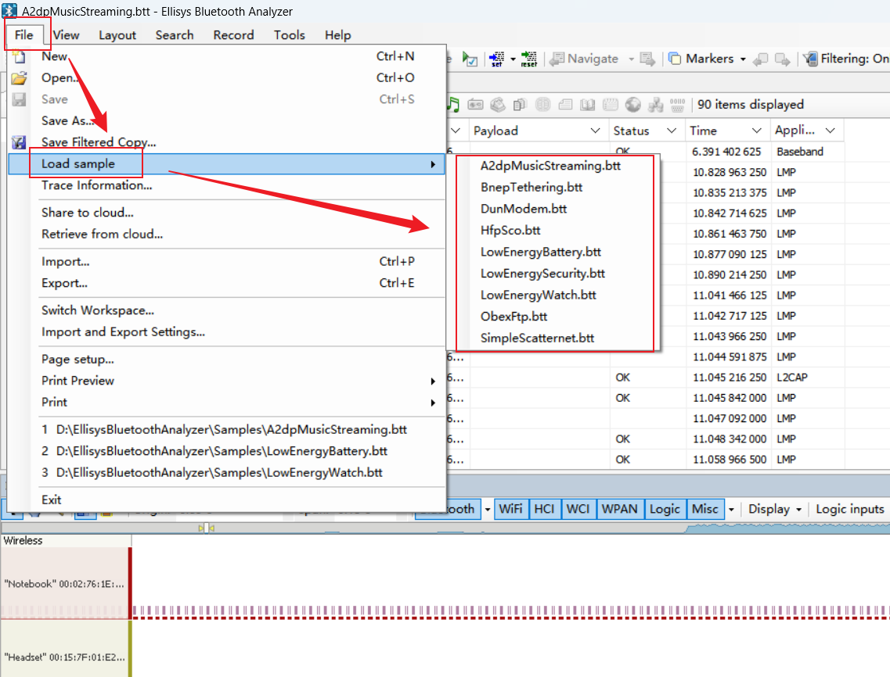

# 申明

1. 该仓库代码源引自 **[bluetooth-low-energy](https://github.com/dineshjakkam/bluetooth-low-energy)**  ，本人只是在大佬的基础上加上的一点点中文注释，以及提供一些中文学习资料，以便中文开发者们学习 BLE HOST。硬件也非常简单是 `STM32F401RETX` + `X-NUCLEO-IDB05A1` ，这两个淘宝上都有卖，合起来价格不超过 200 rmb。	
2. 还有一个超级轻量级的 BLE HOST 仓库，是基于 ESP32 HCI 层的，只实现了广播和扫描：**[toy-ble-stack](https://github.com/mattkelly/toy-ble-stack)**
3. 推荐各位学习 **[bluetooth-low-energy](https://github.com/dineshjakkam/bluetooth-low-energy)**  的原因很简单，这里没有使用到 RTOS ，也没有复杂的数据结构体，就一个链表和几个函数指针，非常通俗易懂。

# Demo 复现视频：

1. <a href="docs/bluetooth-low-energy.pdf">Project report</a>
2. <a href="docs/bluetooth-low-energy.txt">Configuration file</a>
3. [Demo 演示视频：Youtube](https://www.youtube.com/watch?v=9G3L847c0DI)
4. 这里需要使用到 [STM32CubeIDE](https://www.st.com.cn/zh/development-tools/stm32cubeide.html) ，我没有使用过这个 IDE ，所以可能需要各位自行了解如果将该代码导入到 IDE 中。我尝试导入了一下，发现可能需要进行一些调整。各位请自行解决，如果发现成功解决了相关问题，也可以提交 pull requests。

# docs目录介绍

## 中文教程

1. 仓库中的 PDF 教程。

| 文件名                                          | 介绍                                                         |
| ----------------------------------------------- | ------------------------------------------------------------ |
| **低功耗蓝牙开发权威指南@www.java1234.com.pdf** | 这个是 SIG 官方大佬写的书，翻译成的中文版本。对于了解 BLE 的发展以及设计非常有帮助！！！ 目前已经绝版，想买纸质书只能淘宝买盗版。**必看！！！** |
| **刘权-BLE4.0低功耗蓝牙协议总结.pdf**           | 这位大佬写的 BLE 相关学习资料，非常不错，对于了解 BLE 协议栈很有帮助！**必看！！！** |
| **艾克姆科技**                                  | 这是艾克姆科技写的 nRF52832 开发板 BLE 教程，淘宝上有他们的开发板卖。对于入门 BLE 应用开发很有帮助，写的很好！ **应用开发者必看！！！** |
| 清风电子                                        | 清风电子的 nRF52832 开发板 BLE 教程，B站上也有对应的视频教程。怎么说呢，个人感觉，很一般。可以了解吧，只能这么说了，我不想得罪人（哭笑）。 |
| 简单粗暴学蓝牙5（CC2640R2F篇）_20230331.pdf     | 这是 CSDN 上一个叫冬瓜的博主写的文档，可以了解吧，感觉有点用，但不大。 |
| 蓝牙4.0 BLE开发完全手册  物联网开发技术实战.pdf | 基于 TI 的 CC2540 的相关教程书籍，个人觉得没必要看，如果时间多，也可以了解了解。 |
| 蓝牙BLE权威教程.pdf                             | CC254xEK 开发板相关教程，同样感觉可以了解，但没必要。        |

2. [谷雨文档 ：BLE技术揭秘](http://doc.iotxx.com/BLE%E6%8A%80%E6%9C%AF%E6%8F%AD%E7%A7%98)；
3. [红旭无线：BLE基础知识](https://docs.wireless-tech.cn/doc/11/)；
4. CSDN 上有一个叫 [Wireless_Link](https://wlink.blog.csdn.net/) 的蓝牙大佬，他写的博客非常不错。至于视频课程嘛，我只能说，**不适合新手小白**，如果没有 Linux 开发基础，或者是不打算做安卓底层开发，个人觉得，**慎重！！！**
5. [ST 官方 BLE 中文课程(B站)](https://www.bilibili.com/video/BV1Hh4y1t76g/)
6. [ESP32 蓝牙视频教程(B站)](https://www.bilibili.com/video/BV1fs4y1G7eu) --- 注意：这个后面的课程会需要给 up 充电池！如果不想花钱，也想学 ESP32 的蓝牙从机开发，可以看[CSDN：一文迅速上手 ESP32 bluedroid 蓝牙从机开发](https://zyxbeyourself.blog.csdn.net/article/details/141467673)
7. [01 什么是BLE(B站)](https://www.bilibili.com/video/BV1jLoUYjENp) --- 这位可能也是 ST 的工作人员
8. 如果你入门了 BLE 之后想要深入，可以学习 [mynewt-nimble](https://github.com/apache/mynewt-nimble) 这个不仅开源了 HOST 层实现，还开源了 Control 层。乐鑫的 ESP32 就是移植的这个协议栈。

## 示例demo相关资料

1. 这是和 demo 相关的内容

| 文件名                                        | 介绍                                                         |
| --------------------------------------------- | ------------------------------------------------------------ |
| bluetooth-low-energy.pdf                      | 和 STM32CubeMX 上的配置项有关，我们可以参考这个 PDF 配置 STM32CubeMX 复现 demo。 |
| bluetooth-low-energy.txt                      | 介绍了 demo 中每个引脚的配置信息                             |
| C2802540_07F5BD950EABCF019152BAD3F99FA8EE.pdf | 这个是 ST 的那个蓝牙 control 芯片相关介绍信息                |
| MB1136C.pdf                                   | STM32F401RETX 底板原理图                                     |
| stm32f401_reference_manual.pdf                | stm32f401参考手册                                            |
| stm32f401re.pdf                               | stm32f401re Datasheet                                        |
| x-nucleo-idb05a1.pdf                          | 这个是 ST 的那个蓝牙 control 芯片原理图                      |

## Core_v5.4.pdf

1. 这个是 SIG 官方核心文档，其他的资料我们可以去 [SIG 官网](https://www.bluetooth.com/zh-cn/)下载。
2. 可能有人要说了，这是全英文文档，我英文贼差看不懂，怎么办？我英语也很差(笑)，所以我一般都用 [小绿鲸](https://www.xljsci.com/) 进行文献翻译(小绿鲸，打钱！)，各位也可以用知云等文献翻译软件，看个人习惯吧。

# 抓包工具

## nrf52832 dongle

1. 个人感觉红旭无线的 dongle 还行，这个是用来抓取 BLE 空中包的，相比其他的抓包工具，真的太便宜了，几十块钱搞定。

## BLE-AnalyzerPro WCH

1. 沁恒的 BLE 抓包器，个人感觉，上位机很一般。也可以尝试买吧，反正就 88rmb。

## EllisysBluetoothAnalyzer.zip

1. [下载链接](https://download.csdn.net/download/qq_63922192/90697018)
2. 这个是 SIG 提供的抓包工具上位机，虽然 SIG 抓包工具要几个万，个人开发者不可能去买。但是这个软件中含有一些抓包示例可以供我们学习。解压开这个文件夹，然后找到 `Ellisys.BluetoothAnalyzer.exe` 双击打开即可。

2. 示例抓包数据在如下方式打开。

